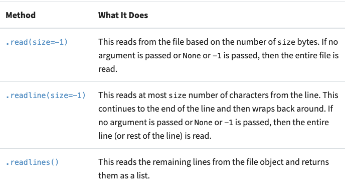
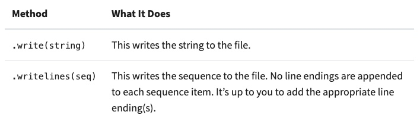
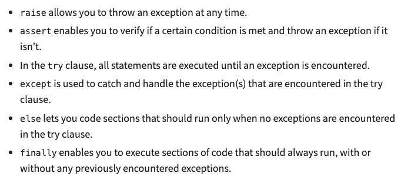

# FileIO & Exceptions  

## [Reading and Writing Files in Python (Guide)](https://realpython.com/read-write-files-python/)  
## What is a file?
A contiguous set of bytes used to store data in a specific format. The byte files are translated to binary 1 & 0 for easier processing. Mostly comprised of header, data, and EOF (end of file). 

>Header: metadata about the contents of the file (file name, size, type, and so on)
>Data: contents of the file as written by the creator or editor
>End of file (EOF): special character that indicates the end of the file

To access the file, a file path is required, which is a string that represents the file location. File path is broken into the folder path, file name, and extension. 

### Line Endings
Windows uses CR+LF (\r or \n)
Unix and Mac uses LF (\n)

### Character Encodings
ASCII and Unicode share the same numerical to character values. 
ASCII can only store 128 characters, while Unicode can contain up to 1,114,112 characters.
Parsing a file with the wrong character encoding can lead to failures/misrepresenation of the character, which can result in an error being thrown. 

## Opening and Closing a file
Open a file using the `open()` built-in function. It has a single required argument, which is a path to the file. It has a single return, which is the file object.
```
file = open('dog_breeds.txt')
```
Always close the file! Leaving it open can lead to resource leaks.
Close by using the `try-finally` block. 
```
reader = open('dog_breeds.txt')
try: 
    ...
finally:
    reader.close()
```
Close using the `with` statement, which closes even in cases with errors. It takes a second positional argument, `mode`. Most common is 'r', which mean read-only mode.
```
with open('dog_breeds.txt') as reader: # with mode: 
    ...
# with mode: 
with open('dog_breeds.txt', 'r') as reader: 
    ...
```
Some other mode options: https://docs.python.org/3/library/functions.html#open 

Three different categories of file objects:
>Text files
>Buffered binary files
>Raw binary files

### Reading and Writing Opened Files
  

#### Iterating Over Each Line in the File
```
>>> with open('dog_breeds.txt', 'r') as reader:
>>>     # Read and print the entire file line by line
>>>     line = reader.readline()
>>>     while line != '':  # The EOF char is an empty string
>>>         print(line, end='')
>>>         line = reader.readline()
Pug
Jack Russell Terrier
English Springer Spaniel
German Shepherd
Staffordshire Bull Terrier
Cavalier King Charles Spaniel
Golden Retriever
West Highland White Terrier
Boxer
Border Terrier
```



#### Bytes
When working with byte strings, add the 'b' character to the mode argument (ex. read only mode - `rb`)

### Tips / Tricks
- `__file__` returns the path relative to where the initial Python script was called. 
- Append to a file using the 'a' character for the mode argument
- Work with two files at the same time:
```
d_path = 'dog_breeds.txt'
d_r_path = 'dog_breeds_reversed.txt'
with open(d_path, 'r') as reader, open(d_r_path, 'w') as writer:
    dog_breeds = reader.readlines()
    writer.writelines(reversed(dog_breeds))
```

## [Python Exceptions: An Introduction](https://realpython.com/python-exceptions/)  
Syntax errors occur when the parser detects an incorrrect statement.
Location of the error is indicated with arrows (>>>). 

Exception errors occur when the code is syntactically correct but encounters an exception. 

### Raising an Exception
Use `raise` to throw an exception if a condition occurs. 
```
x = 10
if x > 5:
    raise Exception('x should not exceed 5. The value of x was: {}'.format(x))
# output:
Traceback (most recent call last):
  File "<input>", line 4, in <module>
Exception: x should not exceed 5. The value of x was: 10
```

Assertion: tests for conditions (if true, continue. if false - throw that error!)
```
import sys
assert ('linux' in sys.platform), "This code runs on Linux only."
# output
Traceback (most recent call last):
  File "<input>", line 2, in <module>
AssertionError: This code runs on Linux only.
```

Try/Except: try -> run code, except -> run this code if there's an exception.

Else: same as try/except but has an `else` (no exceptions? run this code)

Finally: the vaccuum! try > except > else > finally (always run this code)

### Summary: 


## Additional Resources  
### Videos  
[Read & Write Files in Python - Companion Video](https://realpython.com/courses/reading-and-writing-files-python/)  
### Bookmark/Skim  
[Reading and Writing Files in Python Quiz](https://realpython.com/quizzes/read-write-files-python/)  